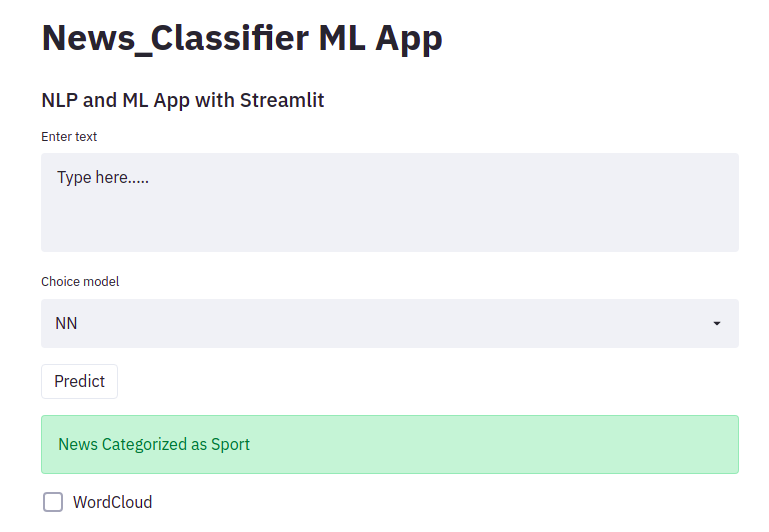

# News Classification
## Table of Content
  * [Demo](#demo)
  * [Overview](#overview)
  * [Technical Aspect](#technical-aspect)
  * [Installation](#installation)
  * [Technologies Used](#technologies-used)
## Demo
[Applink](https://bbc-news-classifier.herokuapp.com/)

[Youtube link: A demo video](https://youtu.be/YfIt3dN5v5c)

[](https://youtu.be/YfIt3dN5v5c)
## Overview
This is a simple text classification Streamlit app trained on the top of Tensorflow & Keras API. The Trained model(model.h5) takes text as an input and predict the category of five different class such as Sport,Business,Entertaiment & Art, Tech, Politics etc.
## Technical Aspect
This project is divided into two part:
  1.Training a deep learning model using Tensorflow.
  2.Building and hosting a Streamlit web app on Heroku. 
## Installation
The code is written in Python 3.7. To install the required packeges and libraries, run this command in the project directory after [cloning]() the respository:
```bash
pip install -r requirements.txt
```
## Technologies Used


[](https://www.tensorflow.org/)
[](https://keras.io/)

[](https://streamlit.io/brand)
